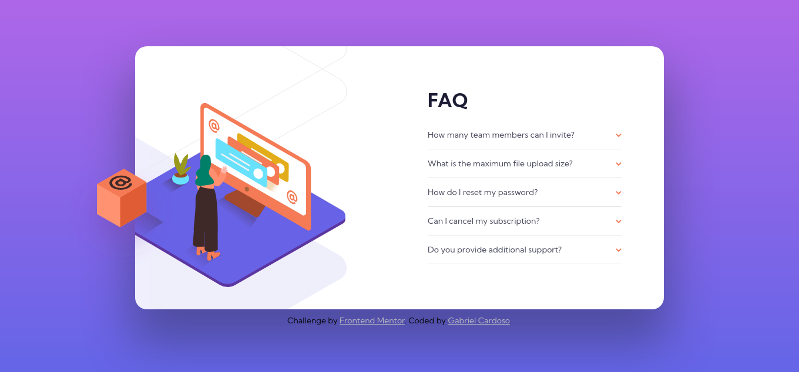
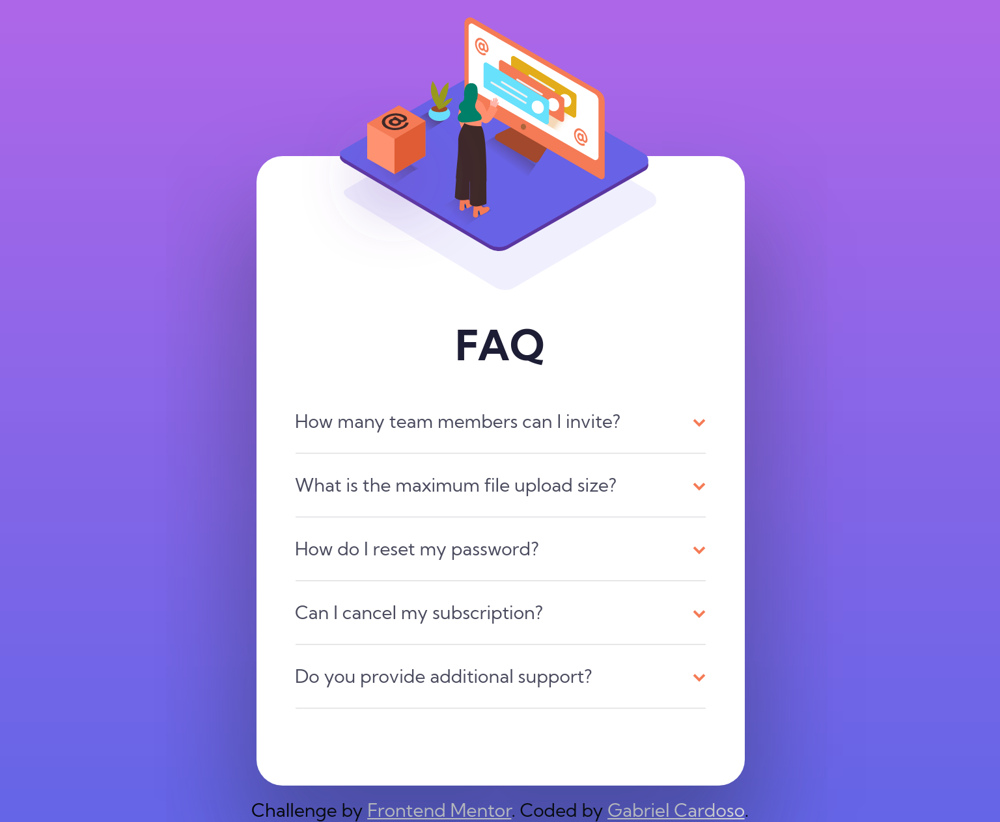

# Frontend Mentor - Faq Accordion Card

This is a solution to the [Faq Accordion Card challenge on Frontend Mentor](https://www.frontendmentor.io/challenges/faq-accordion-card-XlyjD0Oam). Frontend Mentor challenges help you improve your coding skills by building realistic projects.

## Table of contents

- [Screenshots](#screenshots)
- [The challenge](#the-challenge)
- [Links](#links)
- [Built with](#built-with)
- [Author](#author)

### Screenshots

### The challenge

Users should be able to:

- View the optimal layout for the component depending on their device's screen size
- See hover states for all interactive elements on the page
- Hide/Show the answer to a question when the question is clicked
- Bonus: Complete the challenge without using JavaScript

### Links

- Solution URL: https://www.frontendmentor.io/solutions/faq-accordion-card-0oMaJIA6U
- Live Site URL: https://gabrielcardosodev.github.io/faq-accordion-card/

### Built with

- Mobile-first workflow
- Semantic HTML5 markup
- Flexbox
- CSS custom properties

## Author

- Website - [Linkedin](https://www.linkedin.com/in/gabrielcardosodev)
- Frontend Mentor - [@gabrielcardosodev](https://www.frontendmentor.io/profile/gabrielcardosodev)
- Twitter - [@cardjoso](https://www.twitter.com/cardjoso)
